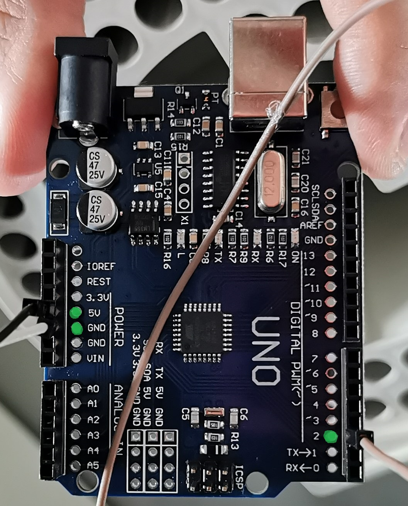

# labrador

Code and designs for a drop-counting assembly.

# Usage

Make sure the hardware and software construction/installation instructions have
been completed before going further.

Note that upon execution of the script, a folder called `data` will be created
in the same directory as the program. This folder stores data collected by the
program (drop times).

## Running labrador

Double click the executable and follow the instructions in the terminal which
pops up. Note that the program may receive commands from your keyboard, even if
the window is not focussed.

## Developer mode: running labrador in a Python environment

Execute `python src/labrador.py` and follow the instructions in the
terminal.

# Installation/ Building

## Hardware

The `designs` directory contains the design for a bracket which will fit onto a
Biorad fraction collector and house the drop sensor. If you wish to edit the
design, the source Blender file is supplied, as well as the .stl file.

Load the .stl file into the slicing software supplied with your 3D printer. The
exact details of the slicing procedure will depend on the printer and material
you wish to use. A successful print was made using a Flashforge Guider IIs using
the settings in `designs/printer.fcfg`.

Once the bracket has been printer, de-solder the LED and infra-red sensor from a
KY-032 infra-red obstacle avoidance module. Re-make the connections using
flexible wiring such that the LED and IR receiver can reach and fit into the
round and rectangular holes of the bracket, respectively, whilst the body of the
sensor is placed on the peg in the housing on the side of the bracket with the
connection pins facing up. Place the LED and IR receiver into their respective
holes on the bracket. They may need to be held in place with some hot glue.

Next, connect the Arduino to your computer, and open `Arduino/labrador` in the
[Arduino IDE](https://docs.arduino.cc/software/ide-v2). Instructions on how to
load programs such as `labrador.ino` onto the Arduino should be easily found
online.

Use `list_com_ports.py` to find the `pid` and `vid` of the device. Copy these
values into `src/labrador.py` (the `pid` and `vid` variables).

Attach the ground and power pins of the IR sensor to the ground and 5V
connections of the Arduino, respectively. Connect the output pin of the IR
sensor to pin 2 of the Arduino. Connect the Arduino to a USB port on your
computer. You should be able to test if every is connected OK using your finger
to block the IR beam. The `Sled` light on the IR sensor should be lit, but will
extinguish when the beam is blocked. Simultaneously, The 'RX' LED on the Arduino
board will temporarily turn off, whilst the 'L' LED turns on.



Now the hardware is ready, go to the software step.

## Software Installation

These software can be run in a Python environment with all required dependencies
installed (see `setup.py`). For portability, the software can also be compiled
into an executable using `pyinstaller`. This can be performed simply if you have
`Make` installed (execute `make` in the terminal). If you do not want to use
`Make`, make sure all of the dependencies are installed (including the extras in
`setup.py`), and run:

```
pyinstaller src/labrador.py --onefile
```

The resulting executable is saved in `dist/`, and can be moved to another
location for execution.

